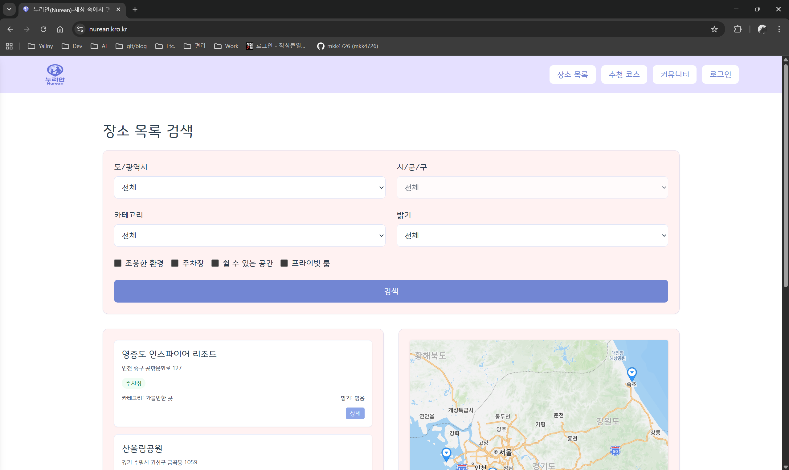
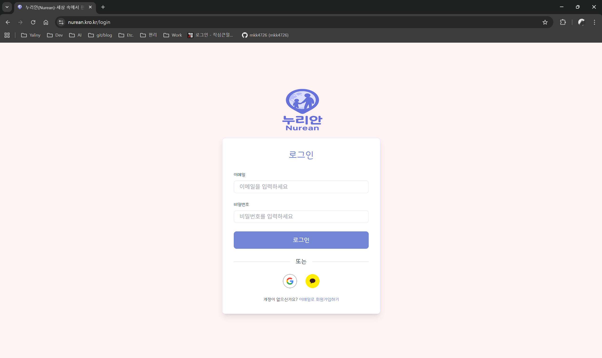
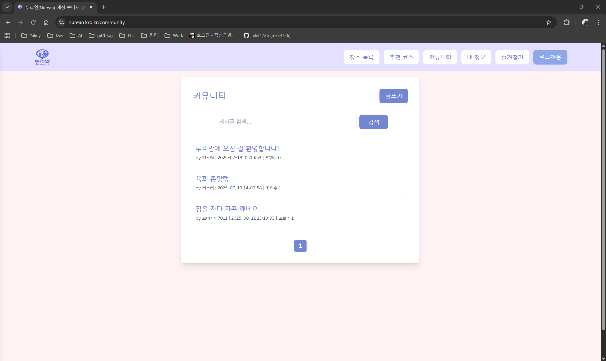
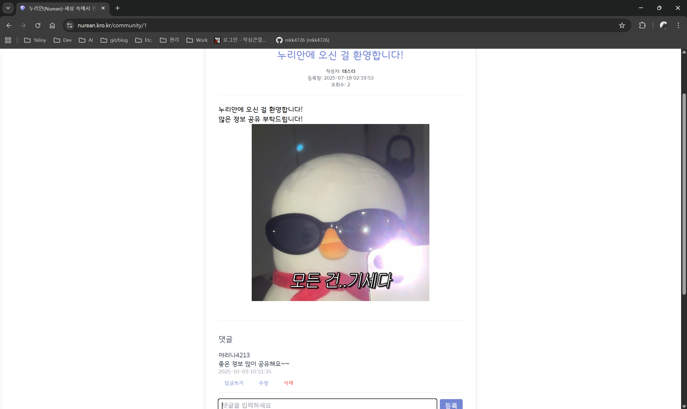
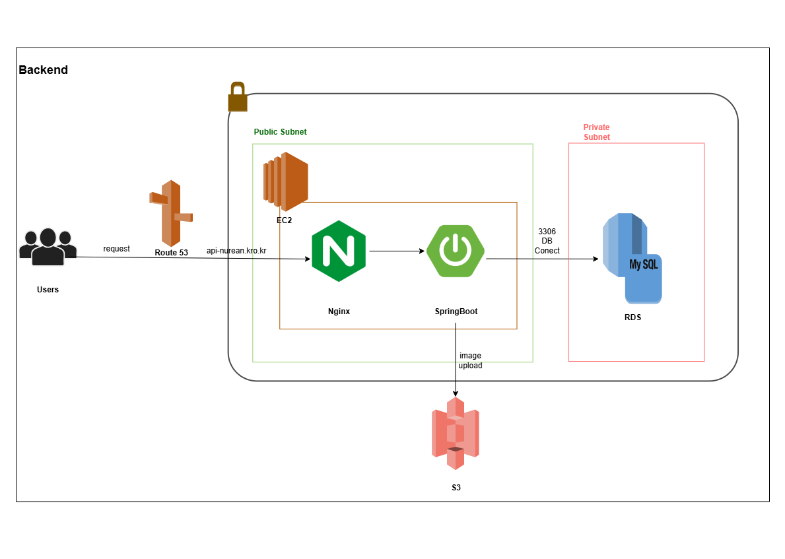
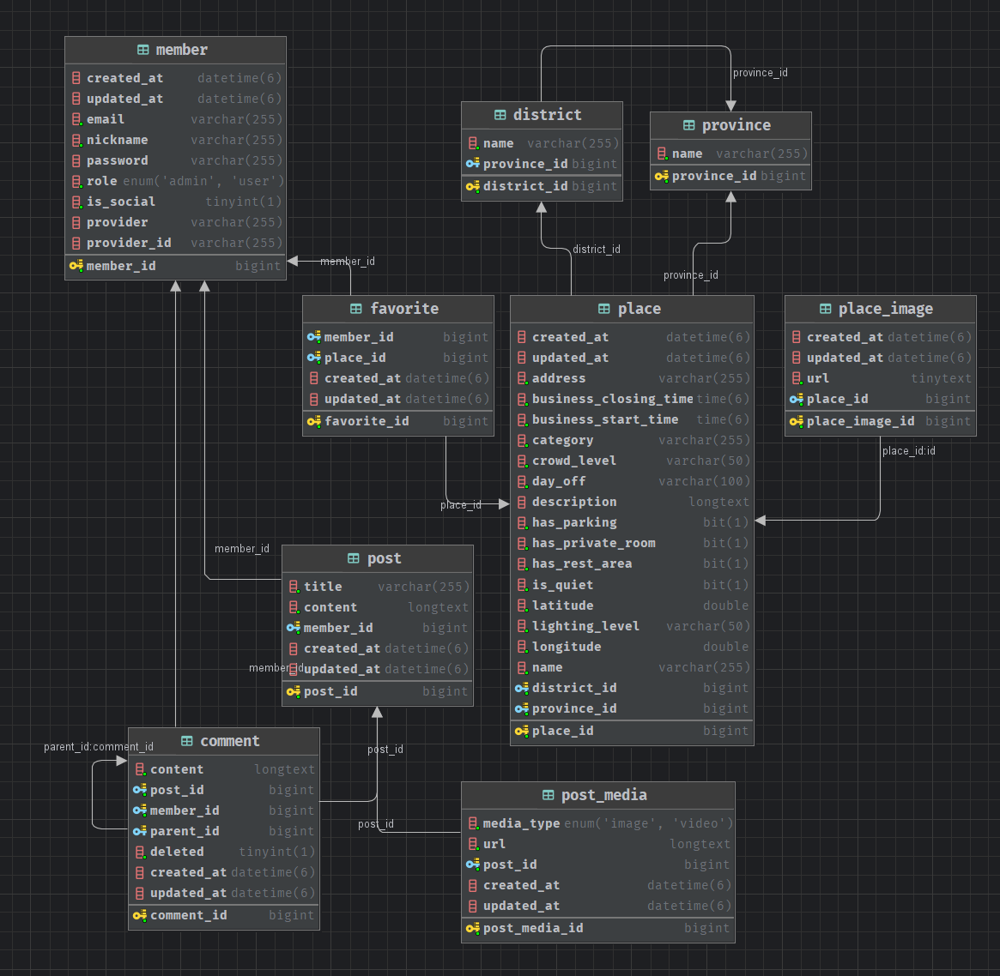

# Nurean : AutismMap (Backend)

<p align="center">
  
</p>

### 누리안(Nurean)은 자폐 아동을 둔 가족을 위한 추천 장소를 수집/검색/커뮤니티로 공유하는 지도 기반 웹 서비스 입니다.
### 서비스는 AWS 프리티어 환경에서 운영 중입니다.

> 🖥️ 서비스: https://nurean.kro.kr  
> 📜 API : https://api-nurean.kro.kr <br>
> 🧭 헬스체크: `GET /` → `"Nurean Server is running."`

---

## 🔎 서비스 미리보기
<p align="center">
  <br>
  <br>
  <br>
  <br>
  <br>
</p>

---

## 📘 API 문서 (Swagger)

- Springdoc(OpenAPI) 기반
- 기본 경로: `/swagger-ui/index.html`
- API Docs: `/nurean/v1/api-docs`

---

## 🧱 기술 스택

| 구분          | 사용 기술                                 |
|-------------|---------------------------------------|
| Language    | Java 17                               |
| Framework   | Spring Boot 3.3.x, Spring MVC         |
| Auth        | Spring Security, JWT (jjwt)           |
| DB/ORM      | JPA(Hibernate), QueryDSL              |
| Storage     | AWS S3                                |
| DB          | dev : H2, <br/> prod : AWS RDS(MySQL) |
| Build/CI/CD | Gradle, GitHub Actions                |
| Docs        | Springdoc OpenAPI (Swagger)           |
| Test        | JUnit 5, Spring Security Test         |

---

## 📂 모듈/패키지 구조 (요약)

```
com.yaliny.autismmap
 ├─ global
 │   ├─ config (SecurityConfig, QuerydslConfig, SwaggerConfig, WebMvcConfig, OAuth2UserConfig, RestAuthenticationEntryPoint)
 │   ├─ exception (ErrorCode 등)
 │   ├─ external.s3 (AwsS3Config, S3Uploader)
 │   ├─ jwt (JwtFilter, JwtUtil)
 │   ├─ response (BaseResponse)
 │   └─ security (CustomUserDetails, SecurityUtil)
 ├─ member (controller, dto, entity, repository, service)
 ├─ place  (controller, dto, entity, query, repository, service)
 ├─ favorite (controller, dto, entity, query, repository, service)
 ├─ region (controller, dto, entity, repository)
 └─ community (controller, dto, entity, repository, service)
```

---

## 🗺 아키텍처 (개요)
<p align="center">
  <br>
</p>


---

## 💾ERD
<p align="center">
  <br>
</p>

---

## 🔌 대표 엔드포인트(요약)

📘 모든 엔드포인트의 상세 스펙 및 스키마는 Swagger UI에서 확인할 수 있습니다. <br>
- URL: https://api-nurean.kro.kr/swagger-ui/index.html

### 🧍‍♀️**Member API (/api/v1/members)**

| Method | Endpoint                   | Description | 비고                                              |
|:------:|:---------------------------|:------------|:------------------------------------------------|
|  POST  | `/signup`                  | 회원가입        | 이메일, 비밀번호, 닉네임 전달                               |
|  POST  | `/login`                   | 로그인         | JWT access/refresh 토큰 발급                        |
| PATCH  | `/{memberId}/nickname`     | 닉네임 수정      | JWT 인증 필요, memberId, 수정할 닉네임 전달                 |
|  GET   | `/{memberId}`              | 회원 정보 조회    | JWT 인증 필요, memberId 전달 |
| DELETE | `/{memberId}`              | 회원 탈퇴       | JWT 인증 필요, memberId 전달 |

### 🗺 **Place API (/api/v1/places)**
- 관리자만 사용 가능(JWT 인증 필요)

| Method | Endpoint     | Description       | 요청 예시                                          |
|:------:|:-------------|:------------------|:-----------------------------------------------|
|  POST  | `/`          | 장소 등록 (이미지 포함 가능) | Multipart 요청 (이미지 리스트, 카테고리, 이름 등)             |
| PATCH  | `/{placeId}` | 장소 수정 (이미지 포함 가능) | `placeId` 필요, Multipart 요청 (이미지 리스트, 카테고리, 이름 등) |
|  GET   | `/`          | 장소 목록 조회          | 카테고리 / 지역 / 키워드 기반 동적 검색                       |
|  GET   | `/{placeId}` | 장소 상세 조회          | 장소 상세 정보 + 이미지 리스트                             |
| DELETE | `/{placeId}` | 장소 삭제             | `placeId` 필요                                     |

### ⭐ **Favorite API (/api/v1/favorites)**

| Method | Endpoint        | Description | 요청 예시                   |
|:------:| :-------------- |:------------| :---------------------- |
|  POST  | `/`             | 장소 즐겨찾기 등록  | `placeId` 전달, JWT 인증 필요 |
|  GET   | `/`             | 장소 즐겨찾기 목록 조회  | JWT 인증 필요               |
|  GET   | `/{favoriteId}` | 장소 즐겨찾기 상세 조회  | 장소 정보 포함                |
| DELETE | `/{favoriteId}` | 장소 즐겨찾기 삭제     | JWT 인증 필요               |

### 🏷 **Region API (/api/v1/regions)**

| Method | Endpoint    | Description           | 요청 예시           |
|:------:| :---------- | :-------------------- |:----------------|
|  GET   | `/province` | 시/도(province) 목록 조회   | 없음              |
|  GET   | `/district` | 시/군/구(district) 목록 조회 | `provinceId` 필요 |

### 💬 **Community API (/api/v1/community)**

| Method | Endpoint                   | Description                          | 요청 예시                                   |
|:------:| :------------------------- | :----------------------------------- | :-------------------------------------- |
|  POST  | `/posts/file`              | 이미지, 동영상 업로드 (`multipart/form-data`) | `files=@image.jpg`                      |
|  POST  | `/posts`                   | 게시글 등록                               | `title`, `content`, `mediaIds`          |
|  GET   | `/posts`                   | 게시글 목록 조회 (검색/페이징 지원)                | `searchText`, `page`, `size`            |
|  GET   | `/posts/{postId}`          | 게시글 상세 조회                            | `postId` 필요                             |
| PATCH  | `/posts/{postId}`          | 게시글 수정                               | `postId`, `PostUpdateRequest`           |
| DELETE | `/posts/{postId}`          | 게시글 삭제                               | `postId` 필요                             |
|  GET   | `/posts/{postId}/comments` | 댓글 목록 조회 (계층 구조 + 페이징)               | `postId`, `page`, `size`                |
|  POST  | `/posts/{postId}/comment`  | 댓글 등록                                | `postId`, `PostCommentCreateRequest`    |
| PATCH  | `/comments/{commentId}`    | 댓글 수정                                | `commentId`, `PostCommentUpdateRequest` |
| DELETE | `/comments/{commentId}`    | 댓글 삭제                                | `commentId` 필요                          |

---

## 🔐 인증 가이드 (JWT)

1) 로그인 → `accessToken` 수신  
2) 보호 API 호출 시 `Authorization: Bearer <accessToken>` 헤더 추가

```bash
# 로그인
curl -X POST http://localhost:8095/api/v1/members/login   -H "Content-Type: application/json"   -d '{"email":"test@ex.com","password":"pass"}'

# 보호 API 호출 예시
curl http://localhost:8095/api/v1/places   -H "Authorization: Bearer <accessToken>"
```

---

## ⚡ Quick Start

> `src/main/resources/application-sample.yml`만 포함됩니다.  
> 로컬 실행 시 아래 절차를 따라주세요.

✅ 실행 체크리스트
  - [x] JDK 17 이상 설치
  - [x] Gradle 8 이상 설치 (wrapper 가능)
  - [x] `application-dev.yml` 생성 (`sample` 복사)
  - [x] `JWT_SECRET` 환경변수 설정
  - [x] `./gradlew bootRun` 실행

```bash
# 1) 샘플을 dev 프로필로 복사
cp src/main/resources/application-sample.yml src/main/resources/application-dev.yml

# 2) 최소 환경변수 (JWT만 있어도 서버 기동 가능)
export SPRING_PROFILES_ACTIVE=dev
export JWT_SECRET="change-me-long-random"

# (선택) S3/소셜로그인까지 사용할 경우 추가 환경변수 설정
export AWS_ACCESS_KEY=""
export AWS_SECRET_KEY=""
export AWS_REGION="ap-northeast-2"
export AWS_S3_BUCKET=""
export GOOGLE_CLIENT_ID=""
export GOOGLE_CLIENT_SECRET=""
export GOOGLE_REDIRECT_URI="http://localhost:8095/login/oauth2/code/google"
export GOOGLE_FRONT_REDIRECT_URI="http://localhost:5173"
export KAKAO_CLIENT_ID=""
export KAKAO_REDIRECT_URI=""
export KAKAO_ADMIN_KEY=""
export FRONT_URL="http://localhost:5173"

# 3) 실행
./gradlew bootRun
```

- H2 콘솔: `http://localhost:8095/h2-console` (JDBC: `jdbc:h2:mem:autismmap`, user: `sa`)  
- Swagger: `http://localhost:8095/swagger-ui/index.html`  
- 헬스체크: `GET /` → `"Nurean Server is running."`

> dev에서 S3·OAuth2 변수를 비워도 서버는 뜹니다(해당 기능만 비활성/실패).

---

## 🧩 Profiles & Config Matrix

| 항목 | dev | prod |
|---|---|---|
| DB | H2(in-memory) | RDS/MySQL |
| JPA `ddl-auto` | `update` | `validate` 권장 |
| Swagger | 활성 | 제한/비활성 권장 |
| 파일 업로드 | S3 선택 | S3 필수 |
| 활성화 방법 | `SPRING_PROFILES_ACTIVE=dev` | `SPRING_PROFILES_ACTIVE=prod` |

> `application.yml`에는 공통 설정만 두고, 활성 프로필은 환경변수/실행 인자로 관리하는 것을 권장합니다.

---

## 🔑 Environment Variables

| 범주 | 키                                                                                                                               | 필수 | 비고 |
|---|---------------------------------------------------------------------------------------------------------------------------------|:---:|---|
| JWT | `JWT_SECRET`                                                                                                                    | ✅ | 긴 랜덤 문자열 권장 |
| S3 | `AWS_ACCESS_KEY`, `AWS_SECRET_KEY`, `AWS_S3_BUCKET`, `AWS_REGION`                                                               | ⭕️ | 업로드 기능 사용 시 필요 |
| OAuth2 | `GOOGLE_CLIENT_ID`, `GOOGLE_CLIENT_SECRET`, `GOOGLE_REDIRECT_URI`, `GOOGLE_FRONT_REDIRECT_URI`, `KAKAO_CLIENT_ID`, `KAKAO_REDIRECT_URI`, `KAKAO_ADMIN_KEY` | ⭕️ | 소셜 로그인 사용 시 필요 |
| Front | `FRONT_URL`                                                                                                                     | ⭕️ | CORS/리다이렉트 참고 |

> 실제 키 이름은 `application-sample.yml`에 모두 명시되어 있습니다.

---

## ☁️ 파일 업로드 (S3)

- `S3Uploader.upload(MultipartFile, dirName)` → 업로드 URL 반환  
- `ObjectMetadata`에 `contentLength`/`contentType` 설정 후 `PutObjectRequest` 사용  
- dev에서 S3 자격 미설정 시 업로드 API는 실패(의도된 동작)

---
## 🚀 배포
- **CI/CD**: GitHub Actions 기반 자동 배포 파이프라인
- **백엔드 배포 구조**: EC2 (Spring Boot Jar) + Nginx + RDS + S3
- **배포 프로세스**: </br>
  1️⃣ main 브랜치 push → Actions 트리거 </br>
  2️⃣ JAR 빌드 및 EC2 업로드 </br>
  3️⃣ 심볼릭 링크 갱신 (current → releases/{hash}) </br>
  4️⃣ stop.sh / run.sh 실행으로 무중단 재시작 </br>
  5️⃣ `/` 헬스체크로 상태 확인 </br>
- 🔐 운영 환경에서는 application-prod.yml 및 Secrets(AWS_KEY, DB_URL, JWT_SECRET 등)을 GitHub Actions → Repository Settings → Secrets에 등록해 관리합니다.

---

## 📄 기타
- 이슈/PR 환영합니다.

---

